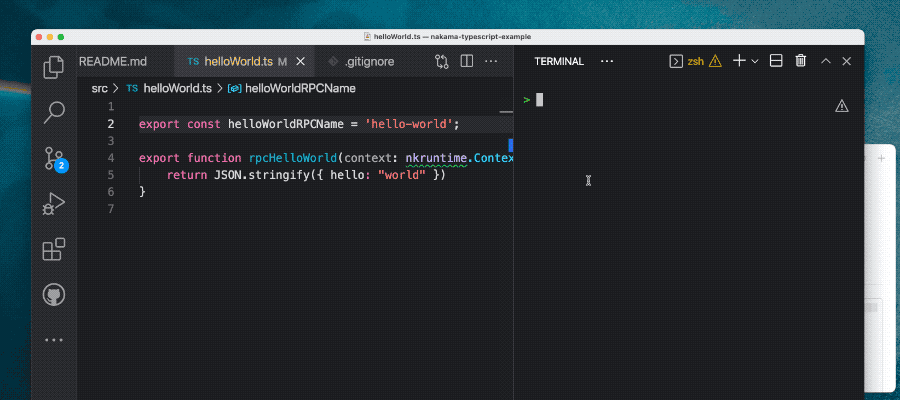

## Nakama TypeScript Watcher

This repo shows how you can set up a [Nakama server](https://heroiclabs.com/docs/nakama/getting-started/introduction/) with TypeScript using (bleeding-edge) modern TypeScript tooling and instant reloading. 

You can work on your server and with every save the TypeScript code is bundled up into a single file and the nakama server is restarted. Iteration time for a trivial app is in the microseconds, I do not have a non-trivial app to test with.

### How it works

There are 2 main components from the JS world: [`tsup`](https://tsup.egoist.sh) and [`watchman`](https://facebook.github.io/watchman/).

#### watchman

Watchman is a server I used in the [TypeScript Website](https://github.com/microsoft/TypeScript-Website/issues/130#issuecomment-664673740) as a build tool. In this repo, it is responsible for watching all the `.ts` files in the repo, running `tsup` when they change and then restarting the nakama dev server. 

Watchman is useful if you have other projects which also use watchman, for example the jest testing suite or relay's watcher. They all use the same file watching process across many different folders,

I don't use docker, I've not had great experiences in the past and it feels like they're at the extractive phase of the tech cycle now anyway - so, I use a [`.env`](./..env) to allow devs to set where the downloaded server is and have my watchman script start/stop that process.

#### tsup

tsup uses esbuild to bundle your server files into a single file, it's close to instant. I keep the settings inside the `package.json` so it can be used both by the `scripts` section as `tsup ./src/server.ts` and inside the watchman script as ` await build({ entry: ["./src/server.ts"] })`.

#### Interesting files

In this repo:

- [`src/server.ts`](src/server.ts) the main root of the TS files
- [`data/modules/server.js`](data/modules/server.js) is the output of tsup (the bundled JS)
- [`src/watch.js`](src/watch.js) the watchman script which bundles and restarts the server